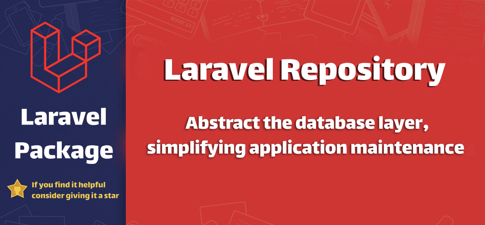

<div align="center">

# Laravel Repository Pattern

[](https://packagist.org/packages/salehhashemi/laravel-repository)
[](https://packagist.org/packages/salehhashemi/laravel-repository)
[](https://github.com/salehhashemi1992/laravel-repository/actions/workflows/static-analysis.yml)
[](https://github.com/salehhashemi1992/laravel-repository/actions/workflows/run-tests.yml)
[](https://codecov.io/gh/salehhashemi1992/laravel-repository)
[](https://phpstan.org/)

</div>

This Laravel package simplifies and streamlines data access by implementing the repository pattern.
It provides a powerful abstraction layer for your database interactions,
enhanced with flexible filtering, searching, and criteria-based querying.



## Features
* **Repository Abstraction:** Decouples data access logic from application code.
* **Dynamic Filtering:** Apply filters to refine database queries.
* **Criteria-Based Filtering:** Define reusable criteria for common query constraints.
* **Search Functionality:** Implement custom search logic based on user input.
* **Modular Repository Interface:** Enforces consistency and maintainability.
* **Ease of Integration:** Seamlessly integrates with Laravel applications.
* **Development Tools:** Automate repository, interface, and filter creation with the `make:repository` command.

## Installation
To install the package, you can run the following command:
```bash
composer require salehhashemi/laravel-repository
```

## Development Tools

The package includes a helpful command to speed up your development workflow:

* **`make:repository`**  This command automates the creation of the following components for a specified model:

   * Repository Class
   * Repository Interface
   * Filter Class

**Usage Example:**

```bash
php artisan make:repository User 
```
or
```bash
php artisan make:repository App\Models\User 
```

## Example Usage
Practical example of how to use this package to manage and interact with a Post model.

It includes examples of a custom repository, filter, criteria, and controller usage.

### Post Repository
The `PostRepository` class extends BaseEloquentRepository and demonstrates the use of the package's features for a Post model.

```php
<?php

namespace App\Repositories;

use App\Filters\PostFilter;
use App\Models\Post;
use App\Repositories\Criteria\FeaturedPostCriteria;
use Illuminate\Contracts\Pagination\Paginator;
use Illuminate\Database\Eloquent\Collection as EloquentCollection;
use Salehhashemi\Repository\BaseEloquentRepository;
use Salehhashemi\Repository\Traits\Searchable;

/**
 * @method \App\Models\Post getModel()
 * @method \App\Models\Post|null findOne(int|string $primaryKey = null)
 * @method \App\Models\Post findOneOrFail(int|string $primaryKey = null)
 */
class PostRepository extends BaseEloquentRepository implements PostRepositoryInterface
{
    use Searchable;

    protected function getFilterManager(): PostFilter
    {
        $filterManager = new PostFilter();
        $filterManager->setQuery($this->getQuery());

        return $filterManager;
    }

    public function findAllFeatured(): EloquentCollection
    {
        $this->addCriteria(new FeaturedPostCriteria());

        return $this->findAll(['limit' => 20]);
    }

    public function searchVisible(array $queryParams, int $perPage): Paginator
    {
        $this->orderBy('sort');
        $this->withCategories();

        return $this->search($queryParams, $perPage);
    }

    public function findOnePublishedOrFail(int $postId): Post
    {
        $this->applyConditions([
            'is_published' => 1,
        ]);

        return $this->findOneOrFail($postId);
    }

    public function withComments(): static
    {
        return $this->with(['comments']);
    }

    public function withCategories(): static
    {
        return $this->with(['categories']);
    }

    /**
     * {@inheritdoc}
     */
    protected function getModelClass(): string
    {
        return Post::class;
    }
}
```

### Post Repository Interface
The `PostRepositoryInterface` defines the contract for our repository, ensuring consistency and clarity in method signatures.

```php
<?php
declare(strict_types=1);

namespace App\Repositories;

use App\Models\Post;
use Illuminate\Contracts\Pagination\Paginator;
use Illuminate\Database\Eloquent\Collection as EloquentCollection;
use Salehhashemi\Repository\Contracts\RepositoryInterface;
use Salehhashemi\Repository\Contracts\SearchableRepositoryInterface;

/**
 * @method \App\Models\Post|null findOne(int|string $primaryKey = null)
 * @method \App\Models\Post findOneOrFail(int|string $primaryKey = null)
 */
interface PostRepositoryInterface extends RepositoryInterface, SearchableRepositoryInterface
{
    public function findAllFeatured(): EloquentCollection;

    public function searchVisible(array $queryParams, int $perPage): Paginator;

    public function findOnePublishedOrFail(int $postId): Post;

    /**
     * @return $this
     */
    public function withComments(): static;

    /**
     * @return $this
     */
    public function withCategories(): static;
}
```
### Post Filter
`PostFilter` demonstrates how to apply custom filters to the Post model, enhancing query flexibility.

```php
<?php
declare(strict_types=1);

namespace App\Filters;

use App\Models\Post;
use Illuminate\Database\Eloquent\Builder as QueryBuilder;
use Salehhashemi\Repository\BaseFilter;

class PostFilter extends BaseFilter
{
    public function applyFilter(array $queryParams): QueryBuilder
    {
        $this
            ->whereLike('title', $queryParams['title'] ?? '', self::WILD_BOTH)
            ->whereValue('status', $queryParams['status'] ?? '')
            ->compare('amount', '<=' $queryParams['max_amount'] ?? '')
            ->dateFrom('created_at', $queryParams['created_from'] ?? '')
            ->dateTo('created_at', $queryParams['created_to'] ?? '');

        if (! empty($queryParams['category_id'])) {
            $this->getQuery()->whereHas('categories', function ($query) use ($queryParams) {
                $query->where('categories.id', $queryParams['category_id']);
            });
        }

        return $this->getQuery();
    }
    
    protected function getModelClass(): string
    {
        return Post::class;
    }
}
```
### Featured Post Criteria
The `FeaturedPostCriteria` is an example of defining criteria for filtering, here focusing on featured posts.

```php
<?php

namespace App\Repositories\Criteria;

use Illuminate\Database\Eloquent\Builder;
use Illuminate\Database\Eloquent\Model;
use Salehhashemi\Repository\Contracts\CriteriaInterface;

class FeaturedPostCriteria implements CriteriaInterface
{
    /**
     * {@inheritDoc}
     */
    public function apply(Model $model, Builder $query): Builder
    {
        $query->where([
            'posts.is_featured' => 1,
        ]);

        return $query;
    }
}
```

## Binding Interface to Implementation
It is crucial to bind the repository interface to its concrete implementation. This enables Laravel service container to automatically resolve and inject the appropriate repository instance wherever it's needed.

1. **Create a Service Provider**
    ```php
    php artisan make:provider RepositoryServiceProvider
    ```
2. **Bind in the Service Provider**
    ```php
    <?php
    
    namespace App\Providers;
    
    use Illuminate\Support\ServiceProvider;
    use App\Repositories\PostRepositoryInterface;
    use App\Repositories\PostRepository;
    
    class RepositoryServiceProvider extends ServiceProvider
    {
        public function register()
        {
            $this->app->bind(
                PostRepositoryInterface::class,
                PostRepository::class
            );
        }
    }    
    ```

3. **Register the Service Provider:** Add your `RepositoryServiceProvider` to the providers array in `config/app.php`.
    ```php
    'providers' => [
        // Other Service Providers
    
        App\Providers\RepositoryServiceProvider::class,
    ],
    ```

## Repository Usage in controller
This example shows how to use the `PostRepository` within a controller, integrating it seamlessly into a Laravel application workflow.

```php
public function index(Request $request, PostRepositoryInterface $postRepository): AnonymousResourceCollection
{
    return PostCollectionResource::collection(
        $postRepository
            ->search(
                $request->query(),
                $request->integer('limit'),
            )
    );
}
```

## Available Methods
This package offers several methods:

### findOne
Fetches a single model instance by primary key, or the first model
matching applied criteria and relations.
```php
$model = $repository->findOne($primaryKey);
```

### findOneOrFail
Similar to findOne, but throws a `ModelNotFoundException` if no result is found.
```php
$model = $repository->findOneOrFail($primaryKey);
```

### findAll 
Retrieves a collection of all models matching the applied criteria, relations, and specified options.
```php
$models = $repository->findAll(['limit' => 10, 'offset' => 5]);
```

### findList
Gets a collection of model values keyed by a specified field, useful for dropdown lists or similar displays.
```php
$list = $repository->findList('id', 'name');
```

### paginate
Returns a paginated collection of models based on applied criteria, relations, and specified page size.
```php
$paginatedModels = $repository->paginate(15);
```

### addCriteria
Adds a new criteria instance to the repository for query filtering.
```php
$repository->addCriteria(new YourCustomCriteria());
```

### orderBy
Specifies ordering for the query results based on field and direction.
```php
$repository->orderBy('created_at', 'DESC');
```

### lockForUpdate
Applies a "lock for update" clause to the query for handling concurrent database access.
```php
$repository->lockForUpdate();
```

### sharedLock
Applies a shared lock to the query, preventing modifications of selected rows.
```php
$repository->sharedLock();
```

## Configuration
To publish the config file, run the following command:
```bash
php artisan vendor:publish --provider="Salehhashemi\Repository\RepositoryServiceProvider" --tag="config"
```
After publishing, make sure to clear the config cache to apply your changes:
```bash
php artisan config:clear
```
Then, you can adjust the pagination limit in the `config/repository.php`

### Exceptions
* `InvalidArgumentException` Thrown if page size is invalid.
* `ModelNotFoundException` Thrown if model not found.

## Docker Setup
This project uses Docker for local development and testing. Make sure you have Docker and Docker Compose installed on your system before proceeding.

### Build the Docker images
```bash
docker-compose build
```

### Start the services
```bash
docker-compose up -d
```
To access the PHP container, you can use:
```bash
docker-compose exec php bash
```

### Testing

```bash
composer test
```

### Changelog

Please see [CHANGELOG](changelog.md) for more information what has changed recently.

## Contributing

Please see [CONTRIBUTING](contributing.md) for details.

## Credits

- [Saleh Hashemi](https://github.com/salehhashemi1992)
- [IMahmood](https://github.com/imahmood)
- [All Contributors](../../contributors)

## License

The MIT License (MIT). Please see [License File](license.md) for more information.